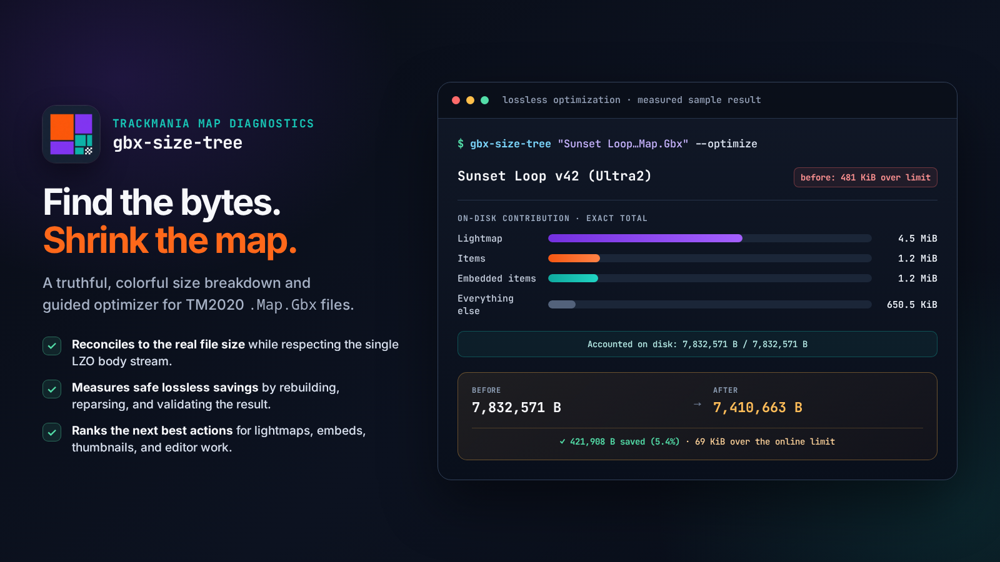

# gbx-size-tree

<p align="center">
  
</p>

Colorful size breakdown + optimizer for Trackmania 2020 `.Map.Gbx` files. See exactly what's
eating your map's bytes — lightmap, embedded items, block/item placements, thumbnail — then
shrink it: lossless recompression, embedded-zip optimization, and flag-gated lossy trims,
with ranked recommendations (including the ones only you can do in the editor).

> ⚠️ Always keep your original map. The tool never overwrites its input
> (output defaults to `<name>_recompressed.Map.Gbx`).

## Usage

```
gbx-size-tree <file.Map.Gbx>              # full diagnostic tree + recommendations
gbx-size-tree <file.Map.Gbx> -i           # interactive: pick actions, re-measure, save
gbx-size-tree <file.Map.Gbx> --optimize   # apply all lossless actions, write output
gbx-size-tree <file.Map.Gbx> --json       # machine-readable report
gbx-size-tree <file.Map.Gbx> -O --attribute  # optimize + per-action savings breakdown
```

Double-clicking the exe (Windows/Wine) opens a file picker (defaults to your
`Documents/Trackmania/Maps`) and an interactive session, and pauses before closing.

## Why sizes are "uncompressed"

A `.Map.Gbx` body is a single LZO stream — individual chunks don't have a real "compressed
size". The report shows exact uncompressed sizes, the real whole-body compressed size, and an
honest per-chunk on-disk *estimate* (already-compressed payloads like WebP/JPEG/zip count
~1:1; the rest is scaled to match the true total).

## Building

.NET 10 SDK, then `just build` / `just test` / `just publish` (self-contained single-file for
linux-x64 + win-x64, trimmed, ~15 MB each; `just release` builds the zips). **Do not enable
NativeAOT on CachyOS-style v4-CRT hosts** — see the note in `Directory.Build.props`.

## License

GPL-3.0-or-later — required by the [GBX.NET.LZO](https://www.nuget.org/packages/GBX.NET.LZO)
dependency (LZO body compression). See `THIRD-PARTY-NOTICES.md`.

Created by [Max Kaye (XertroV)](https://xk.io) + AI.
